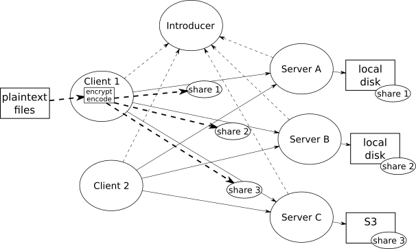
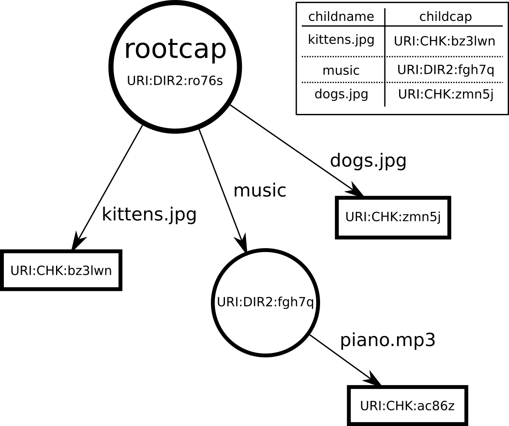

# Tahoe-LAFS: The Least-Authority File System

``Tahoe-LAFS`` is a distributed storage system, started in 2006 as a robust
backend for a personal-backup company named AllMyData (long since defunct).
Before shutting down, the company open-sourced the code, and now a community
of hackers improves and maintains the project.

The system allows you to upload data from your computer into a network of
servers called a "grid", and then retrieve your data from the grid later. In
addition to providing a backup (e.g. in case your laptop hard drive fails),
it offers flexible ways to share specific files or directories with other
users on the same grid. In this way it behaves somewhat like a "network
drive" (SMB or NFS), or a file-transfer protocol (FTP or HTTP).

Tahoe's special feature is "provider-independent security". All files are
encrypted and cryptographically hashed locally, before leaving your computer.
The storage servers never get to see the plaintext (because of the
encryption), nor can they make undetected changes (because of the hashes). In
addition, the ciphertext is erasure-coded into redundant shares, and uploaded
to multiple independent servers. This means your data can survive the loss of
a few servers, to improve durability and availability.

As a result, you can pick storage servers purely on the basis of their
performance, cost, and uptime, without also needing to rely upon them for
security. Most other network drives are entirely vulnerable to the servers:
an attacker who compromises the hosting provider gets to see or modify your
data, or delete it entirely. Tahoe's confidentiality and integrity are
entirely independent of the storage providers, and the availability is
improved too.

# How Tahoe-LAFS Works

A Tahoe "grid" consists of one or more Introducers, some Servers, and some
Clients.

* Clients know how to upload and download data
* Servers hold the encrypted shares
* Introducers help Clients and Servers find and connect to each other

The three node types communicate using a special protocol named "Foolscap",
which is descended from Twisted's "Perspective Broker", but with added
security and flexibility.



Tahoe uses "capability strings" to identify and access all files and
directories. These are random-looking chunks of base32 data which contain the
encryption key, integrity-protecting hashes, and share-location information.
We abbreviate these as "filecaps" when they refer to a file, or "dircaps" for
directories.

(the examples in this chapter are shortened for readability, but filecaps are
normally about 100 characters long)

They sometimes come in multiple flavors: a "writecap" gives whoever knows it
the ability to change a file, whereas a "readcap" only lets them read the
contents. There's even a "verifycap", which allow the holder to verify the
encrypted server-side shares (and generate new ones if some have been lost),
but not to read or modify the plaintext. You can safely give these to a
delegated repair agent to maintain your files while your own computer is
offline.

Tahoe's simplest API call is a command-line ``PUT`` which accepts plaintext
data, uploads it into a brand-new immutable file, and returns the generated
filecap:

```
$ tahoe put kittens.jpg
200 OK
URI:CHK:bz3lwnno6stuspjq5a:mwmb5vaecnd3jz3qc:2:3:3545
```

This filecap is the only way in the world to retrieve the file. You could
write it down, or store it in another file, or store it in a Tahoe directory,
but this string is both necessary and sufficient to recover the file.
Downloads look like this (the ``tahoe get`` command writes the downloaded
data to stdout, so we use the "``>``" shell syntax to redirect this into a
file):

```
$ tahoe get URI:CHK:bz3lwnno6stuspjq5a:mwmb5vaecnd3jz3qc:2:3:3545 >downloaded.jpg
```

We frequently (and perhaps erroneously) refer to filecaps as URIs in many
places, including the filecap strings themselves. "CHK" stands for
"Content-Hash Key", which describes the specific kind of immutable file
encoding we use: other kinds of caps have different identifiers. Immutable
filecaps are always readcaps: nobody in the world can modify the file once
it's been uploaded, even the original uploader.

Tahoe also offers *mutable* files, which means we can change the contents
later. These have three API calls: ``create`` generates a mutable slot,
``publish`` writes new data into the slot (overwriting whatever was there
before), and ``retrieve`` returns the current contents of the slot.

Mutable slots have both writecaps and readcaps. ``create`` gives you the
writecap, but anyone who knows the writecap can "attenuate" it down into a
readcap. This lets you share the readcap with others, but reserve the write
authority for yourself.

In Tahoe, directories are just files that contain a specially-encoded table,
which maps a child name to a filecap or dircap of the child. Think of these
directories as intermediate nodes in a directed graph.



We can create one with the ``mkdir`` command. This defaults to creating a
mutable directory (but we could also create fully-populated immutable
directories, if we wanted to). Tahoe has ``cp`` and ``ls`` commands to copy
files and list directories, and these know how to handle slash-delimited file
paths as usual.

The CLI also tool offers "aliases", which simply store a "rootcap" directory
in a local file (``~/.tahoe/private/aliases``), allowing other commands to
abbreviate the dircap with a prefix that looks a lot like a network drive
indicator (e.g. the Windows ``E:`` drive). This reduces typing and makes
commands much easier to use:

```
$ tahoe mkdir
URI:DIR2:ro76sdlt25ywixu25:lgxvueurtm3
$ tahoe add-alias mydrive URI:DIR2:ro76sdlt25ywixu25:lgxvueurtm3
Alias 'mydrive' added
$ tahoe cp kittens.jpg dogs.jpg mydrive:
Success: files copied
$ tahoe ls URI:DIR2:ro76sdlt25ywixu25:lgxvueurtm3
kittens.jpg
dogs.jpg
$ tahoe mkdir mydrive:music
$ tahoe cp piano.mp3 mydrive:music
$ tahoe ls mydrive:
kittens.jpg
music
dogs.jpg
$ tahoe ls mydrive:music
piano.mp3
$ tahoe cp mydrive:dogs.jpg /tmp/newdogs.jpg
$ ls /tmp
newdogs.jpg
```

The command-line tools are built on top of the HTTP API, which we'll explore
later.

# System Architecture

The Client node is a long-lived gateway daemon, which accepts upload and
download requests from a "frontend" protocol. The most basic frontend is an
HTTP server that listens on the loopback interface (127.0.0.1).

An HTTP ``GET`` is used to retrieve data, which involves multiple steps:

* parse the filecap to extract the decryption key and storage index
* identify which pieces of each share we need to satisfy the client request,
  including both the share data and the intermediate hash tree nodes
* use the storage index to identify which servers might have shares for this
  file
* send download requests to those servers
* track requests we've sent and requests which have completed, to avoid
  duplicate requests unless necessary
* track server response time, to prefer faster servers
* verify shares and reject corrupt ones
* switch to faster servers when available or when connections are lost
* reassemble shares into ciphertext
* decrypt ciphertext and deliver plaintext to the frontend client

This is managed by an event loop that is constantly ready to accept new
``read()`` requests from the frontend managers, or responses from servers, or
timer expirations that indicate it's time to give up on a server and try a
different one. This loop will juggle dozens or even hundreds of simultaneous
connections and timers, and activity on any one them will cause things to
happen on the others. Twisted's event loop is ideal for this design.

In the other direction, the HTTP ``PUT`` and ``POST`` actions cause data to
be uploaded, which does many of the same steps, but backwards:

* the client node accepts data from the frontend protocol and buffers it in a
  temporary file
* the file is hashed to build the "convergent encryption key", which also
  serves to deduplicate files
* the encryption key is hashed to form the storage index
* the storage index identifies which servers we should try to use (the server
  list is sorted a different way for each storage index, and this list
  provides a priority ordering)
* send upload requests to those servers
* if the file was uploaded earlier, the server will tell us they already have
  a share, in which case we don't need to store that one again
* if a server rejects our request (not enough disk space), or doesn't answer
  fast enough, try a different server
* gather responses until each share is mapped to a server
* encrypt and encode each segment of plaintext, which takes a lot of CPU (at
  least compared to the network activity), so we push it off to a separate
  thread to take advantage of multiple cores
* after encoding is done, upload the shares to the previously mapped servers
* when all servers acknowledge receipt, build the final hash trees
* build the filecap from the root of the hash tree and the encryption key
* return the filecap in the HTTP response body

Clients also implement other (non-HTTP) frontend protocols:

* FTP: by supplying a config file of usernames, passwords, and rootcaps, the Tahoe client node can pretend to be an FTP server with a separate virtual directory for each user
* SFTP: like FTP, but layered on top of SSH
* Magic-Folder: a Dropbox-like two-way directory synchronization tool

Clients speak Foolscap to the Introducer, to learn about servers. They also
speak Foolscap to the servers themselves.

The Tahoe-LAFS storage server can store the shares on local disk, or it can
send them to a remote commodity storage service like S3 or Azure. The server
speaks Foolscap on the front side, and e.g. HTTP-based S3 commands on the
back.

On the storage server, the node must accept connections from an arbitrary
number of clients, each of which will send overlapping share upload/download
requests. For remote backends like S3, each client-side request can provoke
multiple S3-side API calls, each of which might fail or timeout (and need to
be retried).

All node types also run an HTTP service for status and management. This
currently renders using Nevow, but we intend to switch to Twisted's built-in
HTTP templating facilities (``twisted.web.template``).

# How it uses Twisted

Tahoe-LAFS uses Twisted extensively: it's hard for us to imagine how we could
have written it any other way.

The application is structured around a Twisted ``MultiService`` hierarchy,
which controls startup and shutdown of the Uploader, the Downloader, the
IntroducerClient, etc. This lets us start individual services during unit
tests, without needing to launch an entire node each time

The largest Service is the ``Node``, which represents an entire Client,
Server, or Introducer. This is the parent ``MultiService`` for everything
else. Shutting down the service (and waiting for all network activity to come
to a halt) is as easy as calling ``stopService()`` and waiting for the
Deferred to fire. Nodes listen on ephemerally-allocated ports by default, and
announce their location to the Introducer. All state is restricted to the
node's "base directory". This makes it easy to launch multiple
clients/servers in a single process, for testing an entire grid at once.
Contrast this to an earlier architecture, in which each storage server
required a separate MySQL database and used fixed TCP ports. In that system,
it was impossible to perform a realistic test without at least 5 distinct
computers. In Tahoe, the integration test suite will spin up a grid with ten
servers, all in a single process, exercise some feature, then shut everything
down again, in just a few seconds. This happens dozens of times whenever you
run ``tox`` to run the test suite.

The variety of frontend interfaces are enabled by Twisted's robust suite of
well-integrated protocol implementations. We didn't have to write an HTTP
client, or server, or the FTP server, or the SSH/SFTP server: these all come
"batteries included" with Twisted.

# Problems we've run into

Our use of Twisted has been fairly smooth. If we were to start again today,
we would still begin with Twisted. Our regrets have been minor:

* dependency load: some users (usually packagers) feel that Tahoe depends
  upon too many libraries. For many years, we tried to avoid adding
  dependencies because Python's packaging tools were immature, but now
  ``pip`` makes this much easier
* packaging/distribution: it is difficult to build a single-file executable
  out of a Python application, so currently users must know about
  Python-specific tools like ``pip`` and ``virtualenv`` to get Tahoe
  installed on their home computers
* Python 3: Twisted now has excellent support for Python 3, but this took
  many years of effort. During this time, we became complacent, and the code
  freely intermixes machine-readable bytes with human-readable strings. Now
  that py3 is the preferred implementation (and the 2020 end-of-life deadline
  for py2 is looming), we're struggling to update our code to work under py3.


## Daemonization Tools

Twisted provides a convenient tool named ``twistd``, which allows long-running
applications to be written as plugins, making Twisted responsible for the
platform-specific details of daemonization (such as detaching from the
controlling tty, logging to a file instead of stdout, and potentially
switching to a non-root user after opening privileged listening TCP ports).
When Tahoe was started, neither "pip" nor "virtualenv" existed yet, so we
built something like them. To combine daemonization with this bespoke
dependency installer/manager, the Tahoe command-line tool includes the
``tahoe start`` and ``tahoe stop`` subcommands.

These days, we'd probably omit these subcommands, and have users run
``twistd`` or ``twist`` (the non-daemonizing form) instead. We would also
look for ways to avoid needing a daemon at all.

In the beginning, ``twistd`` wasn't as easy to manage, so Tahoe used ".tap"
files to control it. This was a holdover from a pattern I used in Buildbot,
where the first versions regrettably used ".tap" files to record state (a
sort of "freeze-dried" copy of the application, which could be thawed out
again the next time you wanted to launch it). Tahoe never put dynamic state
in there, but the ``tahoe create-node`` process would create a ``.tap`` file
with the right initialization code to instantiate and launch the new node.
Then ``tahoe start`` was a simple wrapper around ``twistd -y node.tap``.

Different kinds of ``.tap`` files were used to launch different kinds of
nodes (Clients, Servers, Introducers, etc). This was a bad decision. The .tap
files contained just a few lines: an import statement and code to instantiate
an Application object. Both ended up limiting our ability to rearrange the
codebase or change its behavior: simply renaming the ``Client`` class would
break all existing deployments. We'd accidentally created a public API (with
all the compatibility issues that implies), where the "public" were all the
old ``.tap`` files used by earlier Tahoe installs.

We fixed this by having ``tahoe start`` ignore the contents of the ``.tap``
file, and only pay attention to its filename. Most of the node's configuration
was already stored in a separate INI-style file named ``tahoe.cfg``, so the
transition was pretty easy. When ``tahoe start`` sees ``client.tap``, it
creates a Client instance (as opposed to an Introducer/etc), initializes it
with the config file, and sets the daemon running.


# Internal Filenode Interfaces

Internally, Tahoe defines ``FileNode`` objects, which can be created from
filecap strings for existing files, or from scratch by uploading some data
for the first time. These offer a few simple methods that hide all the
details of encryption, erasure-coding, server-selection, and integrity
checking. The download methods are defined in an Interface named
``IReadable``:

```python
class IReadable(Interface):

    def get_size():
        """Return the length (in bytes) of this readable object."""

    def read(consumer, offset=0, size=None):
        """Download a portion (possibly all) of the file's contents,
        making them available to the given IConsumer. Return a
        Deferred that fires (with the consumer) when the consumer
        is unregistered (either because the last byte has been
        given to it, or because the consumer threw an exception
        during write(), possibly because it no longer wants to
        receive data). The portion downloaded will start at 'offset'
        and contain 'size' bytes (or the remainder of the file if
        size==None).
        """
```

Twisted uses ``zope.interface`` for the classes that support Interface
definitions (that ``Interface`` is really ``zope.interface.Interface``). We
use these as a form of type-checking: the frontend can assert that the object
being read is a provider of ``IReadable``. There are multiple kinds of
``FileNode``s, but they all implement the ``IReadable`` interface, and the
frontend code only uses methods defined on that interface.

The ``read()`` interface doesn't return the data directly: instead, it
accepts a "consumer" to which it can feed the data as it arrives. This uses
Twisted's Producer/Consumer system (described in chapter 1) to stream data
without unnecessary buffering. This allows Tahoe to deliver multi-gigabyte
files without using gigabytes of memory.

``DirectoryNode`` objects can be created similarly. These also have methods
(defined in ``IDirectoryNode``) to list their children, or follow a child
link (by name) to some other node. Mutable directories include methods to add
or replace a child by name.

```python
class IDirectoryNode(IFilesystemNode):
    """I represent a filesystem node that is a container, with a
    name-to-child mapping, holding the tahoe equivalent of a
    directory. All child names are unicode strings, and all children
    are some sort of IFilesystemNode (a file, subdirectory, or
    unknown node).
    """
    def list():
        """I return a Deferred that fires with a dictionary mapping
        child name (a unicode string) to (node, metadata_dict)
        tuples, in which 'node' is an IFilesystemNode and
        'metadata_dict' is a dictionary of metadata."""
    def get(name):
        """I return a Deferred that fires with a specific named
        child node, which is an IFilesystemNode. The child name must
        be a unicode string. I raise NoSuchChildError if I do not
        have a child by that name."""
```

Note that these methods return Deferreds. Directories are stored in files,
and files are stored in shares, and shares are stored on servers. We don't
know exactly when those servers will respond to our download requests, so we
use a Deferred to "wait" for the data to be available.

This graph of node objects is used by each frontend protocol.

# Frontend Protocol Integration

To explore how Tahoe takes advantage of Twisted's diverse protocol support,
we'll look at several "front-end protocols". These provide a bridge between
external programs and the internal
``IFileNode``/``IDirectoryNode``/``IReadable`` interfaces.

All the protocol handlers make use of an internal object named ``Client``,
whose most important method is ``create_node_from_uri``. This takes a filecap
or directorycap (as a string), and returns the corresponding ``FileNode`` or
``DirectoryNode`` object. From here, the caller can use its methods to read
or modify the underlying distributed file.

# The Web Frontend

The Tahoe-LAFS client daemon provides a local HTTP service to control most of
its operations. This includes both a human-oriented web application to browse
files and folders ("WUI": Web User Interface), and a machine-oriented control
interface ("WAPI": Web Application Programming Interface), which we
affectionately pronounce "wooey" and "wappy".

Both are implemented through Twisted's built-in ``twisted.web`` server. A
hierarchy of "Resource" objects route requests to some leaf, which implements
methods like ``render_GET`` to process the request details and provide a
response. By default, this listens on port 3456, but this can be configured
in the ``tahoe.cfg`` file, by providing a different endpoint descriptor.

Tahoe actually uses the "Nevow" project, which provides a layer on top of raw
``twisted.web``, but these days Twisted's built-in functionality is powerful
enough on its own, so we're slowly removing Nevow from the codebase.

The simplest WAPI call is the GET that retrieves a file. The HTTP client
submits a filecap, Tahoe turns this into a ``FileNode``, downloads the
contents, and returns the data in the HTTP response. The request looks like:

```
curl -X GET http://127.0.0.1:3456/uri/URI:CHK:bz3lwnno6stus:mwmb5vae...
```

This results in a ``twisted.web.http.Request`` with a "path" array that has
two elements: the literal string "``uri``", and the filecap. Twisted's
webserver starts with a root resource, upon which you can attach handlers for
different names. Our ``Root`` resource is instantiated with the ``Client``
object described above, and configured with a handler for the ``uri`` name:

```python
from twisted.web.resource import Resource
class Root(Resource):
    def __init__(self, client):
        ...
        self.putChild("uri", URIHandler(client))
```

All requests that start with ``uri/`` will get routed to this ``URIHandler``
resource. When these requests have additional path components (i.e. our
filecap), they'll cause the ``getChild`` method to be called, which is
responsible for finding the right Resource to handle the request. We'll
create a FileNode or DirectoryNode from the given filecap/dircap, and then
we'll wrap it in a web-specific handler object that knows how to deal with
HTTP requests:

```python
class URIHandler(Resource):
    def __init__(self, client):
        self.client = client
    def getChild(self, path, request):
        # 'path' is expected to be a filecap or dircap
        try:
            node = self.client.create_node_from_uri(path)
            return directory.make_handler_for(node, self.client)
        except (TypeError, AssertionError):
            raise WebError("'%s' is not a valid file- or directory- cap"
                           % name)
```

``node`` is the ``FileNode`` object that wraps the filecap from the GET
request. The handler comes from a helper function that inspects the node's
available interfaces and decides what sort of wrapper to create:

```python
def make_handler_for(node, client, parentnode=None, name=None):
    if parentnode:
        assert IDirectoryNode.providedBy(parentnode)
    if IFileNode.providedBy(node):
        return FileNodeHandler(client, node, parentnode, name)
    if IDirectoryNode.providedBy(node):
        return DirectoryNodeHandler(client, node, parentnode, name)
    return UnknownNodeHandler(client, node, parentnode, name)
```

For our example, this returns the ``FileNodeHandler``. This handler has a lot
of options, and the actual code in ``web/filenode.py`` looks quite different,
but a simplified form would read like this:

```python
class FileNodeHandler(Resource):
    def __init__(self, client, node, parentnode=None, name=None):
        self.node = node
        ...
    @inlineCallbacks
    def render_GET(self, request):
        version = yield self.node.get_best_readable_version()
        filesize = version.get_size()
        first, size, contentsize = 0, None, filesize
        ... # these will be modified by a Range header, if present
        request.setHeader("content-length", b"%d" % contentsize)
        yield version.read(request, first, size)
```

Twisted's native web server doesn't allow ``Resource`` objects to return
Deferreds, but Nevow's does, which is convenient. Here's basically what
happens:

* First, we ask the filenode for it's best readable version. This isn't
  needed on immutable files (for which there's only one version anyways), but
  mutable files might have multiple versions on the grid. "best" means the
  most recent. We get back a "version" object that provides the ``IReadable``
  interface.
* Next we compute the size of the file. For immutable files, the size is
  embedded in the filecap, so the ``get_size()`` method lets us compute this
  immediately. For mutable files, the size was determined when we retrieved
  the version object.
* We use the file's size and a Range header (if provided) to figure out how
  much data to read, and what offset to start from.
* We set the Content-Length header to tell the HTTP client how much data to
  expect.
* The ``IReadable``'s ``read()`` method is called to begin the download. The
  Request object is also an IConsumer, and the download code builds an
  IProducer to attach to it. This returns a Deferred that will fire when the
  last byte of the file has been delivered to the consumer.
* When the last Deferred fires, the server knows it can close the TCP
  connection, or reset it for the next request.

We've elided many of the details, which are expanded below.

## File Types, Content-Type, /name/

Tahoe's storage model maps filecaps to bytestrings, without names, dates, or
other metadata. *Directories* contain names and dates, in the table entries
that point to their children, but a basic filecap just gives you a bunch of
bytes.

However the HTTP protocol includes a ``Content-Type`` for each download,
which allows the browser to figure out how to render the page (HTML, JPG, or
PNG), or what OS metadata to record when saving it to disk. In addition, most
browsers assume the last component of the URL path is a filename, and the
"save to disk" feature will use it as the default filename.

To deal with this mismatch, Tahoe's WAPI has a feature to let you download a
filecap with an arbitrary name in the last element of the path. The WUI
directory browser puts these special URLs in the HTML of the directory page,
so "Save Link As.." works correctly. The full URL looks like this:

```
http://127.0.0.1:3456/named/URI:CHK:bz3lwnno6stus:mwmb5vae../kittens.jpg
```

This looks a lot like a directory and a child inside it. To avoid visual
confusion, we usually insert an extra funny-looking string into such URLs:

```
http://127.0.0.1:3456/named/URI:CHK:bz3lwn../@@named=/kittens.jpg
```

This is implemented with a ``Named`` Resource that creates a
``FileNodeHandler``, but also remembers the last component of the URL path in
``self.filename`` (ignoring any intermediate components, like that
``@@named=`` string). Then, when we run ``render_GET``, we pass this filename
into a Twisted utility that maps the filename suffix to a type string, using
the equivalent of ``/etc/mime.types``. From this, we can set the
``Content-Type`` and ``Content-Encoding`` headers.

```python
    # from twisted.web import static
    ctype, encoding = static.getTypeAndEncoding(
        self.filename,
        static.File.contentTypes,
        static.File.contentEncodings,
        defaultType="text/plain")
    request.setHeader("content-type", ctype)
    if encoding:
        request.setHeader("content-encoding", encoding)
```

## Saving to Disk

When you click on a link, the browser will try to render the document that
comes back: HTML goes through layout, images get drawn in the window, audio
files get played, etc. If it doesn't recognize the file type, it will offer
to save the file to disk instead. Tahoe's "WUI" HTML frontend offers a way to
force this save-to-disk behavior: for any URL that points at a file, just
append a ``?save=True`` query argument to the URL. The web server acts on
this by adding a ``Content-Disposition`` header, which instructs the browser
to always save the response, instead of trying to render it:

```python
    if boolean_of_arg(get_arg(request, "save", "False")):
        request.setHeader("content-disposition",
                          'attachment; filename="%s"' % self.filename)
```

## Range Headers

The web frontend allows HTTP clients to request just a subset of the file by
providing a Range header. This is frequently used by streaming media players
(like VLC or iTunes) when the "scrubber" is used to jump around in a movie or
audio file. Tahoe's encoding scheme was specifically designed to support this
sort of random-access efficiently, by using Merkle hash trees.

Merkle hash trees start by chopping up the data into segments and applying a
cryptographic hash function (SHA256) to each segment. Then we hash each pair
of segment hashes into a second layer (half the length of the first). This
reduction process is repeated until we have a single "root hash" at the top
of a binary tree of intermediate hash nodes, with the segments at the bottom.
The root hash is stored in the filecap, and we send everything else (segments
and intermediate hashes) to the server. During retrieval, any single segment
can be validated against the stored root without downloading all the other
segments, by asking the server to provide the companion hash nodes for the
path from that segment up to the root. This enables fast validation of
arbitrary segments with minimum data transfer.

The web frontend handles this by parsing the request's Range header, setting
the response's Content-Range and Content-Length headers, and modifying the
``first`` and ``size`` values that we pass into the ``read()`` method:

Parsing the Range header is non-trivial, since it can include a list of
(potentially overlapping) ranges, which might include the beginning or end of
the file, and it might be expressed in various units (not just bytes).
Fortunately servers are allowed to ignore unparseable Range specifications:
it's not efficient, but they can just return the entire file, as if the Range
header didn't exist. The client is then obligated to ignore the portions of
the data they didn't want.

```python
    first, size, contentsize = 0, None, filesize
    request.setHeader("accept-ranges", "bytes")

    rangeheader = request.getHeader('range')
    if rangeheader:
        ranges = self.parse_range_header(rangeheader)

        # ranges = None means the header didn't parse, so ignore
        # the header as if it didn't exist.  If is more than one
        # range, then just return the first for now, until we can
        # generate multipart/byteranges.
        if ranges is not None:
            first, last = ranges[0]

            if first >= filesize:
                raise WebError('First beyond end of file',
                               http.REQUESTED_RANGE_NOT_SATISFIABLE)
            else:
                first = max(0, first)
                last = min(filesize-1, last)

                request.setResponseCode(http.PARTIAL_CONTENT)
                request.setHeader('content-range',"bytes %s-%s/%s" %
                                  (str(first), str(last),
                                   str(filesize)))
                contentsize = last - first + 1
                size = contentsize

    request.setHeader("content-length", b"%d" % contentsize)
```

## Error Conversion on the Return Side

Tahoe's internal API throws a variety of exceptions when something goes
wrong. For example, if too many servers have failed, the file may not be
recoverable (at least not until some servers come back online). We try to map
these exceptions into sensible HTTP error codes with an exception handler
that runs at the end of the HTTP processing chain. The core of this handler
is named ``humanize_failure()``, and looks at the
``twisted.python.failure.Failure`` object that wraps all exceptions raised
during the processing of a Deferred:

```python
def humanize_failure(f):
    # return text, responsecode
    if f.check(EmptyPathnameComponentError):
        return ("The webapi does not allow empty pathname components, "
                "i.e. a double slash", http.BAD_REQUEST)
    if f.check(ExistingChildError):
        return ("There was already a child by that name, and you asked me "
                "to not replace it.", http.CONFLICT)
    if f.check(NoSuchChildError):
        quoted_name = quote_output(f.value.args[0], encoding="utf-8")
        return ("No such child: %s" % quoted_name, http.NOT_FOUND)
    if f.check(NotEnoughSharesError):
        t = ("NotEnoughSharesError: This indicates that some "
             "servers were unavailable, or that shares have been "
             "lost to server departure, hard drive failure, or disk "
             "corruption. You should perform a filecheck on "
             "this object to learn more.\n\nThe full error message is:\n"
             "%s") % str(f.value)
        return (t, http.GONE)
    ...
```

The first half of the return value is a string to put into the HTTP response
body; the second is the HTTP error code itself.

## Rendering UI Elements: Nevow Templates

Tahoe's WUI provides a file-browser interface: directory panels, file
listings, upload/download selectors, delete buttons, etc. These are made up
of HTML, rendered on the server side from Nevow templates.

The ``web/`` directory contains an XHTML file for each page, with
placeholders that are filled in with variables by the
``DirectoryNodeHandler`` class. Each placeholder is a namespaced XML element
that names a "slot". The directory listing template looks like this:

```html
<table class="tahoe-directory" n:render="sequence" n:data="children">
  <tr n:pattern="header">
    <th>Type</th>
    <th>Filename</th>
    <th>Size</th>
  </tr>
  <tr n:pattern="item" n:render="row">
    <td><n:slot name="type"/></td>
    <td><n:slot name="filename"/></td>
    <td align="right"><n:slot name="size"/></td>
  </tr>
```

The code which populates this form, in ``directory.py``, loops over all
children of the directory being rendered, examines its type, and uses a
``ctx`` "context" object to fill in each slot by name. For files, the ``T.a``
Nevow tag produces a hyperlink, with the ``href=`` attribute pointing at a
download URL using the ``/named/`` prefix described earlier:

```python
    ...
elif IImmutableFileNode.providedBy(target):
    dlurl = "%s/named/%s/@@named=/%s" % (root, quoted_uri, nameurl)
    ctx.fillSlots("filename", T.a(href=dlurl, rel="noreferrer")[name])
    ctx.fillSlots("type", "FILE")
    ctx.fillSlots("size", target.get_size())
```

Nevow also offers tools to build HTML input forms. These are used to
construct the upload file-picker form, and the "make directory" name input
element.

# The FTP Frontend

The frontend protocols allow other applications to access this internal file
graph, in some form that matches their existing data model. For example, the
FTP frontend assigns each "account" (a username / password pair) to a root
dircap. When an FTP client connects to this account, they are presented with
a filesystem that starts at this directory node, and only extends downwards
(into child files and subdirectories). In a normal FTP server, all accounts
see the same filesystem, but with different permissions (Alice cannot read
Bob's files), and different starting directories (Alice starts in
``/home/alice``, Bob starts in ``/home/bob``). In the Tahoe FTP server, Alice
and Bob will have entirely distinct views of the filesystem, which may not
overlap at all (unless they have arranged to share some portion of their
space).

Tahoe's FTP frontend builds upon Twisted's FTP server
(``twisted.protocols.ftp``). The FTP server uses Twisted's
["Cred" framework](link to Cred docs on twistedmatrix.com) for account
management (which involves "Portals", "Realms", and "Avatars"). As a result,
the server is made up of several components:

* Endpoint: This defines what TCP port the server will listen on, along with
  options like which network interfaces to use (e.g. the server can be
  restricted to only listen on 127.0.0.1, the loopback interface)
* ``FTPFactory`` (``twisted.protocols.ftp.FTPFactory``): This provides the
  overall FTP server. It is a "protocol factory", so it will be invoked each
  time a new client connects, and it is responsible for building the
  ``Protocol`` instance that manages that specific connection. When you tell
  the Endpoint to start listening, you give it a factory object.
* Checker: This is an object that implements ``ICredentialsChecker`` and
  handles authentication, by examining some credentials and (if successful)
  returning an "Avatar ID". In the FTP protocol, the credentials are a
  username and password supplied by the user. In SFTP, they include an SSH
  public key. The "Avatar ID" is just a username. The Tahoe FTP frontend can
  be configured to use an ``AccountFileChecker`` (in auth.py), which stores
  the username/password/rootcap mapping in a local file. It can also use an
  ``AccountURLChecker``, which queries an HTTP server (it POSTs the username
  and password, and gets the rootcap back in the response). The
  ``AccountURLChecker`` was used for centralized account management back at
  AllMyData.
* Avatar: This is the server-side object that handles a specific user's
  experience. It is also specific to a service type, so it must implement
  some particular ``Interface``, in this case a Twisted interface named
  ``IFTPShell`` (which has methods like ``makeDirectory``, ``stat``,
  ``list``, and ``openForReading``).
* Realm: This is any object which implements Twisted's ``IRealm`` interface,
  and is responsible for turning an Avatar ID into an Avatar. The Realm API
  also deals with multiple interfaces: a client that needs a specific kind of
  access can ask for a specific ``Interface``, and the Realm might return a
  different Avatar depending on what they ask for. In the Tahoe FTP frontend,
  the realm is a class named ``Dispatcher`` that knows how to create a root
  directory node from the account information and wrap it in a handler.
* ``Portal`` (``twisted.cred.portal.Portal``): This is a Twisted object that
  manages the Checkers and the Realms. The ``FTPFactory`` is configured with
  a ``Portal`` instance at construction time, and everything involving
  authorization is delegated to the portal.
* ``Handler`` (``allmydata.frontends.ftpd.Handler``): This is a Tahoe object
  that implements Twisted's ``IFTPShell``, and translates FTP concepts into
  Tahoe concepts.

The Tahoe FTP server code does the following:

* create a ``MultiService`` that hangs off the top-level Node multiservice
* hang a ``strports.service`` off that, listening on the FTP server port
* configure that listener with an ``FTPFactory``
* configure the factory with a ``Portal``
* create a ``Dispatcher`` for use as the Portal's "realm"
* add an ``AccountFileChecker`` and/or an ``AccountURLChecker`` to the Portal

When an FTP client connects, the username and password are submitted to the
``AccountFileChecker``, which had previously parsed the accounts file into
memory. The account lookup is pretty simple:

```python
class FTPAvatarID:
    def __init__(self, username, rootcap):
        self.username = username
        self.rootcap = rootcap
 
@implementer(checkers.ICredentialsChecker)
class AccountFileChecker(object):
    def requestAvatarId(self, creds):
        if credentials.IUsernamePassword.providedBy(creds):
            return self._checkPassword(creds)
        ...
    
    def _checkPassword(self, creds):
        try:
            correct = self.passwords[creds.username]
        except KeyError:
            return defer.fail(error.UnauthorizedLogin())

        d = defer.maybeDeferred(creds.checkPassword, correct)
        d.addCallback(self._cbPasswordMatch, str(creds.username))
        return d
    
    def _cbPasswordMatch(self, matched, username):
        if matched:
            return self._avatarId(username)
        raise error.UnauthorizedLogin
    
    def _avatarId(self, username):
        return FTPAvatarID(username, self.rootcaps[username])
```

If the username is not on the list, or if the password doesn't match,
``requestAvatarId`` will return a Deferred that errbacks with
``UnauthorizedLogin``, and the FTPFactory will return the appropriate FTP
error code. If both are good, it returns an ``FTPAvatarID`` object that
encapsulates the username and the account's rootcap URI (which is just a
string).

When this succeeds, the Portal asks its Realm (i.e. our Dispatcher object) to
turn the Avatar ID into a handler. Our realm is also pretty simple:

```python
@implementer(portal.IRealm)
class Dispatcher(object):
    def __init__(self, client):
        self.client = client
    
    def requestAvatar(self, avatarID, mind, interface):
        assert interface == ftp.IFTPShell
        rootnode = self.client.create_node_from_uri(avatarID.rootcap)
        convergence = self.client.convergence
        s = Handler(self.client, rootnode, avatarID.username, convergence)
        def logout(): pass
        return (interface, s, None)
```

First, we assert that we're being asked for an ``IFTPShell``, not some other
interface (which we don't know how to deal with). Then, we use the Tahoe
file-graph API to convert the rootcap URI into a directory node. The
"convergence secret" is outside the scope of this chapter, but it exists to
provide safe deduplication, and is provided to the Handler to let us extend
the interface to use distinct convergence secrets for each account.

Then, we build a Handler around the Client (which provides methods to create
brand new filenodes) and the rootnode (which provides access to the user's
"home directory" and everything below it), and return this to the portal.
That's enough to get the FTP server connected.

Later, when the client performs an "``ls``" command, our handler's ``list()``
method will get invoked. Our implementation is responsible for translating
the FTP notion of listing a directory (it gets a list of path-name
components, relative to the root) into Tahoe's notion (which does a step-wise
traversal from the root directory node down into some other dirnode).

```python
    def list(self, path, keys=()):
        d = self._get_node_and_metadata_for_path(path)
        def _list((node, metadata)):
            if IDirectoryNode.providedBy(node):
                return node.list()
            return { path[-1]: (node, metadata) }
        d.addCallback(_list)
        def _render(children):
            results = []
            for (name, childnode) in children.iteritems():
                results.append( (name.encode("utf-8"),
                                 self._populate_row(keys, childnode) ) )
            return results
        d.addCallback(_render)
        d.addErrback(self._convert_error)
        return d
```

We start with a common "follow the path from the root" helper method, which
returns a Deferred that eventually fires with the node and metadata for the
file or directory named by the path (if the path is ``foo/bar``, then we'll
ask our root dirnode for its ``foo`` child, expect that child to be a
directory, then ask that subdirectory for its ``bar`` child). If the path
pointed to a directory, we use the Tahoe IDirectoryNode's ``node.list()``
method to gets its children: this returns a dictionary that maps child name
to (child node, metadata) tuples. If the path pointed to a file, we pretend
that it pointed to a directory with only the one file in it.

Then we need to turn this dictionary of children into something the FTP
server can accept. In the FTP protocol, the ``LIST`` command can ask for
different attributes: sometimes the client wants owner/group names, sometimes
it wants permissions, sometimes all it cares about is the list of child
names. Twisted's ``IFTPShell`` interface expresses this by giving the
``list()`` method a sequence of "keys" (strings) to indicate which values it
wants. Our ``_populate_row()`` method turns one child+metadata pair into the
correct list of values.

```python
    def _populate_row(self, keys, (childnode, metadata)):
        values = []
        isdir = bool(IDirectoryNode.providedBy(childnode))
        for key in keys:
            if key == "size":
                if isdir:
                    value = 0
                else:
                    value = childnode.get_size() or 0
            elif key == "directory":
                value = isdir
            elif key == "permissions":
                value = IntishPermissions(0600)
            elif key == "hardlinks":
                value = 1
            elif key == "modified":
                if "linkmotime" in metadata.get("tahoe", {}):
                    value = metadata["tahoe"]["linkmotime"]
                else:
                    value = metadata.get("mtime", 0)
            elif key == "owner":
                value = self.username
            elif key == "group":
                value = self.username
            else:
                value = "??"
            values.append(value)
        return values
```

For each key that Twisted wants, we translate this into something we can get
from Tahoe's ``IFileNode`` or ``IDirectoryNode`` interfaces. Most of these
are simple lookups in the metadata, or are obtained by calling a method on
the Node object. One unusual case is ``permissions``: see below for details.

The last step is to attach ``_convert_error`` as an errback handler. This
converts some Tahoe-specific errors into their closest FTP equivalent, which
is more useful than the "internal server error" that the client would get if
they weren't converted.

```python
    def _convert_error(self, f):
        if f.check(NoSuchChildError):
            childname = f.value.args[0].encode("utf-8")
            msg = "'%s' doesn't exist" % childname
            raise ftp.FileNotFoundError(msg)
        if f.check(ExistingChildError):
            msg = f.value.args[0].encode("utf-8")
            raise ftp.FileExistsError(msg)
        return f
```

# The SFTP Frontend

SFTP is a file-transfer protocol built upon the SSH secure shell encryption
layer. It exposes a very POSIX-like API to remote clients: open, seek, read,
and write, all on the same filehandle. FTP, on the other hand, only offers
all-or-nothing transfer of individual files. FTP is a much better fit for
Tahoe's file model, but SFTP is more secure when speaking to remote servers.

The advantage of using ``Cred`` is that the same authentication mechanism can
be re-used with other protocols. FTP and SFTP, despite their differences, use
the same basic access model: clients are identified by some credentials, and
this gives access to a particular home directory. In Tahoe, both FTP and SFTP
use the same ``FTPAvatarID`` and ``AccountFileChecker`` classes above.
``AccountFileChecker`` defines "``credentialInterfaces``" to cover all the
kinds of authentication that might be presented: ``IUsernamePassword``,
``IUsernameHashedPassword``, and ``ISSHPrivateKey`` (this is specific to
SFTP, and allows users to be identified by their SSH public key, instead of a
password).

They only differ in the Realm (our ``Dispatcher`` class), which returns a
different kind of handler for the two protocols.


# Backward-Incompatible Twisted APIs

Tahoe has no notion of Access Control Lists (ACLs), usernames, or
read/write/execute permission bits: it follows the object-capability
discipline of "if you can reference an object, you can use it". Filecaps are
unguessable, so the only way to reference a file is by knowing the filecap,
which can only come from someone who uploaded the file originally, or from
someone else who learned it from the uploader.

Most files are stored in directories, so access control is managed through
directory-traversal, which is safe because Tahoe directories do not have
"parent" links. You can share one of your own directories with someone else
by simply giving them a link: they cannot use this to reach anything "above"
the one directory you gave them.

As a result, the FTP server always returns "0600" for the "permissions"
field, which means "read and write by the current user only". This value is
mostly cosmetic: FTP clients only use it to populate the "mode" column of a
long-form (``ls -l``) directory listing. We could be more accurate here,
returning "0400" for immutable objects, but we didn't really care enough to
make the change.

However, even a static value caused problems when one of Twisted's APIs
changed unexpectedly. In the early days, Twisted used integers to represent
file modes/permissions (just like the Unix kernel, and most C programs).
Eventually folks realized that this is pretty unix-centric, so in
Twisted-11.1.0, a nice clean ``filepath.Permissions`` class was created to
hold this kind information as a collections of booleans.

But the FTP server wasn't updated to use it until much later. Up until
Twisted-14.0.2, the "permissions" value of ``list()`` was expected to return
an integer. From Twisted-15.0.0 and onwards, it was expected to return a
``Permissions`` instance. Moreover, it *only* accepted a ``Permissions``
instance: returning an integer would cause an exception.

In effect, the ``IFTPShell`` interface changed abruptly between 14.0.2 and
15.0.0, which we discovered when we started getting bug reports about FTP
``ls`` commands failing for folks who had upgraded (we didn't have end-to-end
test coverage for this frontend, and our personal manual tests were still
using Twisted-14.0.2, so we didn't notice the problem ourselves).

Twisted usually does a fantastic job of deprecating APIs for a couple
releases before making incompatible changes, but this one slipped through the
cracks, probably because the most common implementation of ``IFTPShell`` is
Twisted's built-in ``FTPShell`` class, which was updated at the same time. So
another way to describe the problem was that ``IFTPShell`` was modified
without a deprecation period, as if it were a private internal API, but in
fact it was public.

The easiest way to resolve this would have been to make Tahoe's ``setup.py``
require ``Twisted >= 15.0.0``, and change the code to return a
``Permissions`` object. But this would have made life more difficult for
folks building Tahoe on Linux distributions that included a version of
Twisted that was a few years out of date. (Debian 8.0 "jessie" was released
in 2015 with Twisted-14.0.2, and wasn't replaced until 2017). Back then,
Tahoe was trying to be compatible with a wide range of Twisted versions. We
felt bad about asking users to upgrade their system Twisted just to satisfy
Tahoe's enthusiasm for modern fashions.

So to allow Tahoe work with both old and new Twisteds, we needed to return
something that behaved like an integer when necessary, but could behave like
a ``Permissions`` too. When we examined the way that Twisted-14.0.2 used the
value, we found that it always did a bitwise AND of the value during the
formatting process:

```python
# twisted-14.0.2: twisted/protocols/ftp.py line 428
def formatMode(mode):
    return ''.join([mode & (256 >> n) and 'rwx'[n % 3] or '-' for n in range(9)])
```

This let us build a helper class that inherited from ``Permissions``, but
overrode the ``__and__`` method to return an integer if it got used by the
older Twisted:

```python
# filepath.Permissions was added in Twisted-11.1.0, which we require.
# Twisted <15.0.0 expected an int, and only does '&' on it. Twisted
# >=15.0.0 expects a filepath.Permissions. This satisfies both.

class IntishPermissions(filepath.Permissions):
    def __init__(self, statModeInt):
        self._tahoe_statModeInt = statModeInt
        filepath.Permissions.__init__(self, statModeInt)
    def __and__(self, other):
        return self._tahoe_statModeInt & other
```

These days, the situation is different. We no longer recommend that users
install Tahoe (or any Python application) into a system-wide location like
``/usr/local/bin``, nor do we recommend that Tahoe be run against
system-provided python libraries. Instead, users who build from source should
be installing Tahoe into a new virtualenv, where it is easy to simply install
the latest versions of all dependencies, and they can be safely isolated from
the system python.

The ``pipsi`` tool makes this quite easy: ``pipsi install tahoe-lafs`` will
create a Tahoe-specific virtualenv, install Tahoe and all its dependencies
into it, then symlink just the ``tahoe`` executable into
``~/.local/bin/tahoe`` where it will probably be on your $PATH. ``pipsi`` is
now the recommended method to install Tahoe from a source tree.

A system-wide install should be done through the OS package manager. For
example, ``apt install tahoe-lafs`` will get a working ``/usr/bin/tahoe`` on
modern Debian and Ubuntu releases, and they'll use system-wide dependencies
(like Twisted) from ``/usr/lib/python2.7/dist-packages``. The Debian
developers (and other packagers) are responsible for making sure the
system-wide libraries are compatible with all packaged applications: Tahoe,
Magic-Wormhole, Buildbot, Mercurial, Trac, etc. When Tahoe bumps its
dependency on Twisted, it is the packagers who must figure this stuff out.
And if the system upgrades a library like Twisted, and it contains an
unexpected incompatibility, that upgrade can be reverted until Tahoe can be
patched to resolve the problem.

# Summary

Tahoe-LAFS is a large project, started in 2006 when Twisted itself was not
very old. It contains workarounds for bugs that no longer exist, and
techniques that have been superceded by new Twisted features. At times, the
code might seem to reflect the developers' historical fears and personal
idiosyncrasies better than it serves as a good teaching example.

But it also embeds years of experience working with the Twisted codebase "in
anger" (not casually). And although Tahoe-LAFS might not be a household name,
its core ideas have influenced and been incorporated into numerous other
decentralized storage systems (written in Go, Node.js, Rust, and more).

Twisted's central event loop, and the wealth of ready-to-use protocol
implementations, have been critical to our feature set. If you really didn't
like event-driven systems, you might try to implement something similiar with
threads and locks (on the client, you'd need a separate thread for writing to
each server, a second thread for receiving from each server, a third batch
for each frontend request, all of which must carefully use locks against
concurrent access). The chances of this working safely are pretty low.

The Python standard library includes some fine protocol implementations, but
they're almost all written in a blocking style, limiting them to programs
that do only one thing at a time. Hopefully this will change as Python 3 and
``asyncio`` gather momentum. In the meantime, Twisted is the best tool for a
project like this.

# References

* Tahoe-LAFS home page: https://tahoe-lafs.org
* Tahoe-LAFS Github page: https://github.com/tahoe-lafs/tahoe-lafs
* Nevow: https://github.com/twisted/nevow
* Foolscap: https://foolscap.lothar.com/
* pipsi: https://github.com/mitsuhiko/pipsi/

